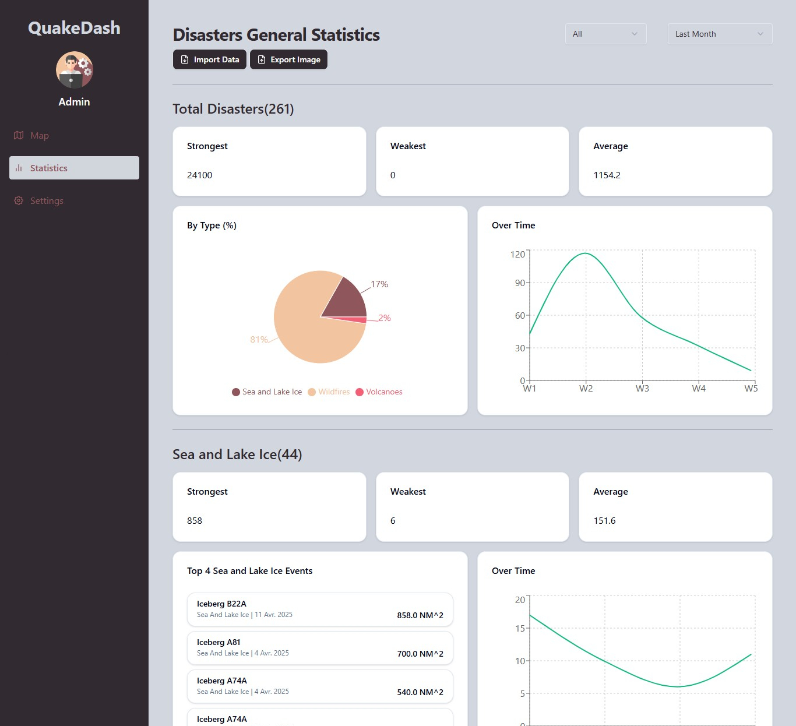

# 🌍 Earthquake Realtime Map and Stats

A web application that visualizes statistics and recent earthquakes on an interactive map using Leaflet and USGS (United States Geological Survey) earthquake data.

## 🚀 Features

- 📊 Displays recent earthquakes on a dynamic map
- 🕒 Filter earthquakes by time range:
  - Last hour
  - Last day
  - Last week
  - Last month
- 📈 Filter earthquakes by minimum magnitude
- ⚡ Real-time loading indicator during data fetch
- 💻 Built with Next.js, React, TailwindCSS, Leaflet

## 🧠 How it works

- Fetches earthquake data from the USGS GeoJSON feed
- Uses Leaflet to render interactive map with markers for each earthquake
- React state updates the map in real time when filters change

## 🛠 Tech Stack

- **Frontend**: Next.js (App Router), Tailwind CSS, Shadcn
- **Map**: Leaflet with React integration
- **Data Source**: [USGS Earthquake API](https://earthquake.usgs.gov/earthquakes/feed/v1.0/geojson.php)

## 📦 Getting Started

1. Clone the repository:
   ```bash
   git clone https://github.com/AlaBhs/quakedash.git
   cd earthquake-map
   ```

2. Install dependencies:
   ```bash
   npm install
   ```

3. Run the development server:
   ```bash
   npm run dev
   ```

4. Open `http://localhost:3000` in your browser.

## 📷 Screenshots

### 🌍 Earthquake Map View


### 🔍 Filter by min magnitude Example


### 📈 General Statistics


## 📄 License

MIT License – [AlaBhs](https://github.com/AlaBhs)
